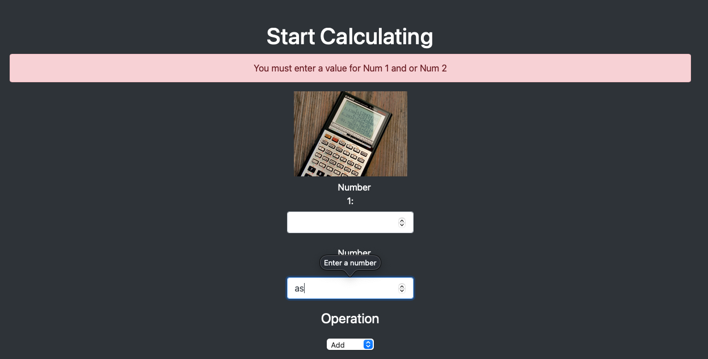
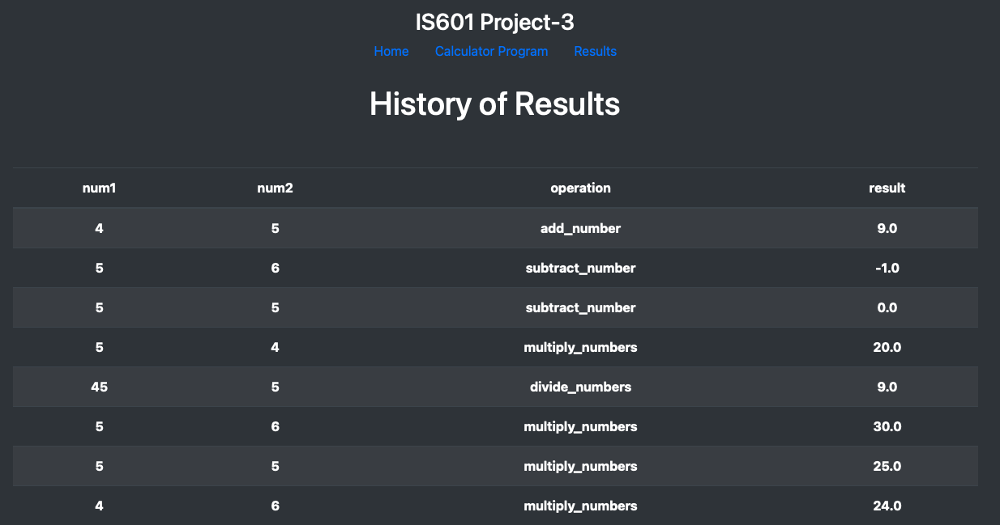

# Calculator Project Setup

Run Pip Install
pip install -r requirements.txt

To run tests, Lint, and Coverage report use this command:

pytest  --pylint --cov

.pylintrc is the config for pylint
.coveragerc is the config for coverage
setup.py is a config file for pytest

# Pylint Output

# Coverage

# Home

# Calculate

# Validation 

# Result

# History of Operation

# Project 2

# Separation of Contents

